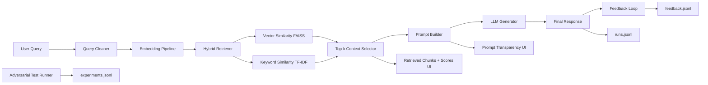

# RAG Architecture Diagram

## Notes

- Retrieval fix path: hybrid ranking (vector + keyword + domain boost)
- Evaluation path: adversarial queries + RAG vs pure LLM comparison
- Logging path: run logs, experiments, and feedback are stored in `logs/`
